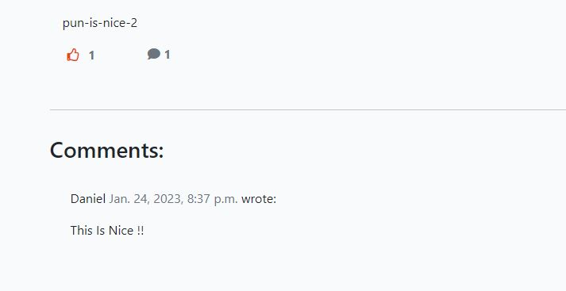
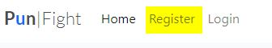
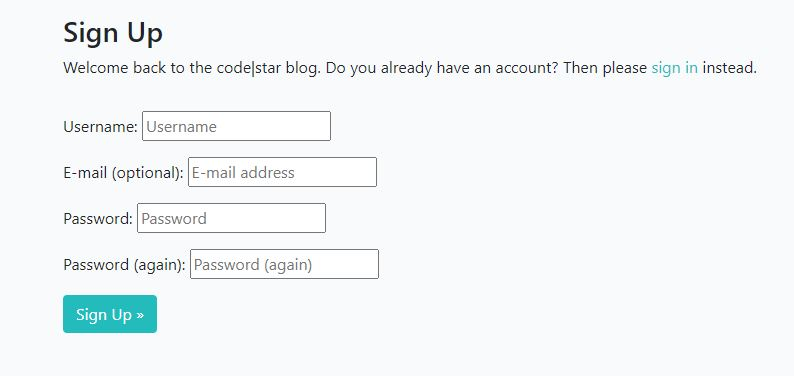
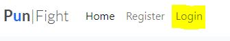
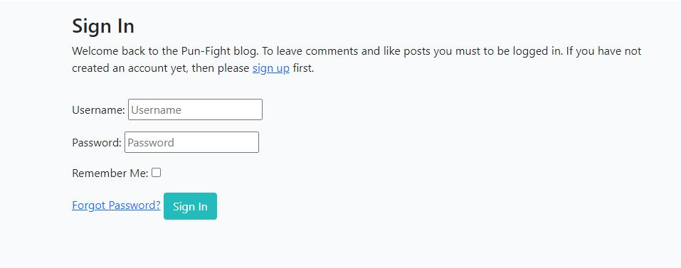
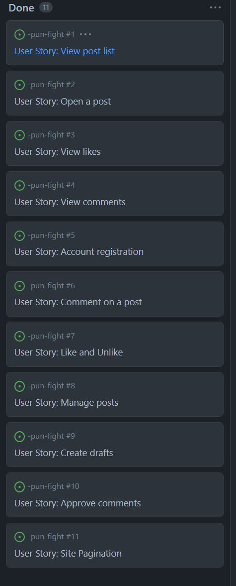

# Pun-Fight-Blog

- Pun-Fight-Blog is a Django Python blog with the objective of forment the Great art of Pun 
- Users can read posts comment like and sign in 
- the Blog cover various forms of Pun fight as fun facts about and top Pun for some categories (Hoo My Deer ! )  
###
- The live link can be found here - [Pun-Fight-Blog](https://pun-fight.herokuapp.com/) 

## Menu and navigation

At the initial page you'll have "Home" "Register"and "Login"
######
The user can access the post at the home page as preavious image once logged the user have the possibility of Like posts and make commnets.

#
- Register

The user will be able to register at the main page.

##

#
 Login

The user will be able to login once registered 

##

#

## User Stories 
####

####

### Testing

I have tested the project doing the following

- passed on [PEP8](http://pep8online.com/).
- Tested on Heroku and the Terminal.

  #### Bugs

-
  #### Remain Bugs

- 

 #### Validator Testing 

 - [PEP8](http://pep8online.com/)
   - Initially found few errors that where fixed only 2 Warnings left

 #### Deployment 
- When you create the app, you will need to add two buildpacks from the Settings tab. The ordering is as follows:

   - heroku/python
    - heroku/nodejs
    - You must then create a Config Var called - PORT. Set this to 8000

    
  -  Connect your GitHub repository and deploy as normal.

  #### Credits

  
   - [Code Institute](https://www.CodeInstitute.net) Based on I Think Therefore I Blog module.
   - [Youtube](https://www.youtube.com/)
   